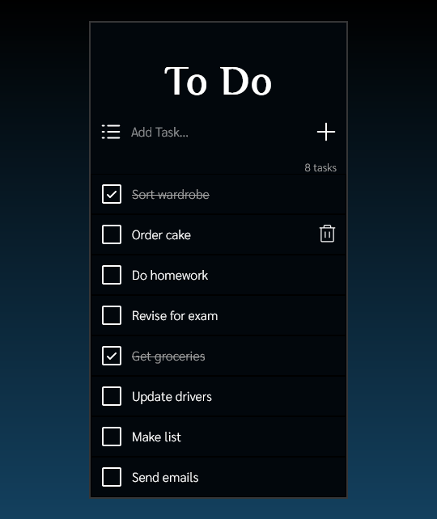

# To Do App Frontend

This project is the frontend for a full stack To Do app using React/TypeScript.
The corresponding backend repo can be found here: https://github.com/xbmac2/nology-todo-backend-xandra

## Features

Create, delete, and check off tasks from a To Do List.

## Error Handling

Errors thrown by the fetch requests are caught and handled with toast notifications. **To revisit:** Utilised zodResolver to validate the form inputs but couldn't find an elegant way to render that, so errors due to fom submission are logged to the console for now.

- If a 'bad request' is allowed through, and the 400 response is caught, and a toast notification is displayed, change the test in AddTAskInput.test.tsx to reflect this.

## Tests

Component tests are included, utilising mocks and spies. Run tests in watch mode: `npm test`

## Future Updates

- Tests for fetch request functions (throws errors, returns correct data etc.)
- A feature where users can add tasks to "Lists" or "Categories" (a homework todo list, a cleaning todo list etc)
